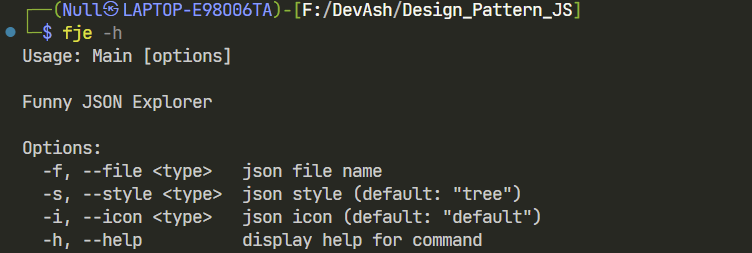
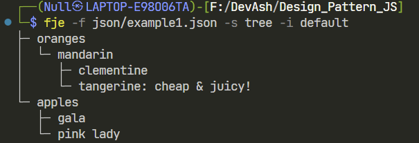
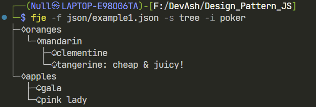
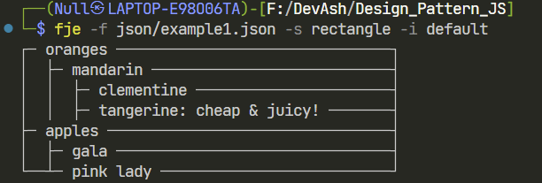
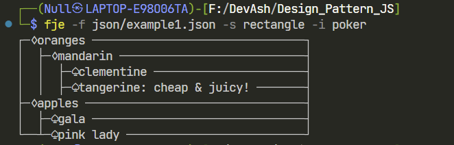
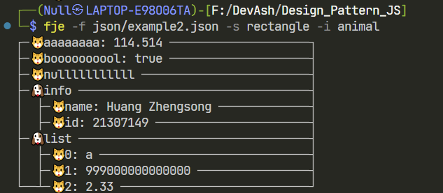

# Funny JSON Explorer


Funny JSON Explorer（**FJE**），一个JSON文件可视化的命令行界面小工具，诞生于SYSU王青老师软件工程课程Design Pattern作业，使用JavaScript语言编写

```sh
{
    oranges: {
        'mandarin': {                            ├─ oranges
            clementine: null,                    │  └─ mandarin
            tangerine: 'cheap & juicy!'  -=>     │     ├─ clementine
        }                                        │     └─ tangerine: cheap & juicy!
    },                                           └─ apples
    apples: {                                       ├─ gala
        'gala': null,                               └─ pink lady
        'pink lady': null
    }
}
```

FJE可以快速切换**风格**（style），包括：树形（tree）、矩形（rectangle）；

```sh
├─ oranges                             ┌─ oranges ───────────────────────────────┐
│  └─ mandarin                         │  ├─ mandarin ───────────────────────────┤
│     ├─ clementine                    │  │  ├─ clementine ──────────────────────┤
│     └─ tangerine: cheap & juicy!     │  │  ├─ tangerine: cheap & juicy! ───────┤
└─ apples                              ├─ apples ────────────────────────────────┤
   └─ gala                             └──┴─ gala ───────────────────────────────┘

        树形（tree）                                   矩形（rectangle）
```

也可以指定**图标族**（icon family），为中间节点或叶节点指定一套icon，也可以通过配置`config/icons.json`文件自定义你自己喜欢的图标！

```sh
├─♢oranges
│  └─♢mandarin
│     ├─♤clementine
│     └─♤tangerine: cheap & juicy!
└─♢apples
   └─♤gala

poker-face-icon-family: 中间节点icon：♢ 叶节点icon：♤
```

## 使用方式

首先确保本地安装了[Node.js](https://nodejs.org/)，接着依次执行：

```sh
git clone https://github.com/Wilsooon09/Funny_JSON_Explorer
cd Funny_JSON_Explorer
npm install
npm link
```

使用说明：

```shell
fje -f <json file> -s <style> -i <icon family>
```

- `<json file>`为需要可视化的JSON文件的路径
- `<style>`（可选）为指定可视化的样式，目前仅支持tree(默认)、rectangle
- `<icon family>`（可选）为指定图标族，默认不显示，内置的图标族有poker、smiley和animal，可通过`config/icons.json`文件自定义添加

也可以通过输入命令`fje -h`获取使用指南


## 自定义图标族

编辑`config/icons.json`文件

```sh
{
    "smiley": {
        "leafIcon": "😊",
        "nodeIcon": "😎"
    },
    "animal": {
        "leafIcon": "🐱",
        "nodeIcon": "🐶"
    }
}
```

项目已预先配置了`smiley`和`animal`两款自定义图标族，你可以按如上格式添加或修改你喜欢的图标

## 运行截图

树形 + 无图标:


树形 + Poker图标:


矩形 + 无图标:


矩形 + Poker图标:


使用自定义图标族:


## 使用的第三方库

commander 10.0.1
