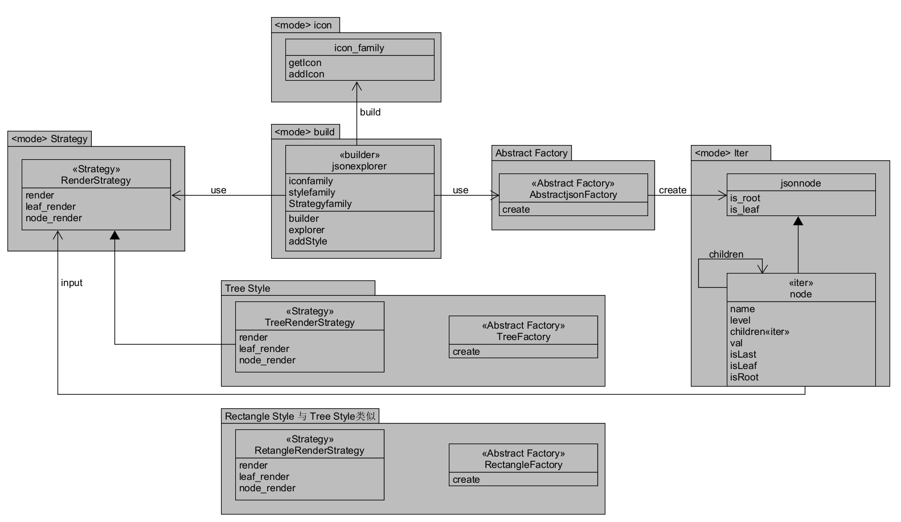

# 设计文档

本文档将提供类图与说明，说明使用的设计模式及作用，并进一步说明如何不改变现有代码，只需添加新的抽象工厂，即可添加新的风格，在完成功能的同时，使得程序易于扩展和维护。

## UML类图



下面将分别说明图中使用到的设计模式及作用

## 迭代器模式（Iterator Pattern）

迭代器模式提供了一种方法来顺序访问聚合对象中的元素，而无需暴露其底层表示。在你的代码中，这种模式用于遍历 JSON 结构，并生成表示结构的字符串列表。

在代码中，迭代器模式主要体现在 TreeNode 和 RectangleNode 类中，尤其是在 render 方法中。该方法递归地遍历 JSON 结构，创建表示该结构的字符串列表。

以下是迭代器模式的应用方式：

**TreeNode 和 RectangleNode 类：**

这些类包含一个 children 数组，用于存放子节点。
render 方法迭代该 children 数组，以处理每个子节点。

**TreeRenderStrategy 和 RectangleRenderStrategy：**

这些策略定义了节点的渲染方式。
每个策略的 render 方法处理当前节点，并通过调用子节点的 render 方法来遍历其子节点。

此外 Node 和 node 中的 children 也是迭代器模式，迭代访问node的儿子节点

## 策略模式（Strategy Pattern）

策略模式定义了一组算法，将每个算法封装起来，并使它们可以互换。该模式允许算法独立于使用它的客户端而变化。

在代码中，策略模式用于提供不同的 JSON 节点渲染策略。每种策略决定如何显示 JSON 数据。

以下是策略模式的应用方式：

**渲染策略：**

TreeRenderStrategy 和 RectangleRenderStrategy 是具体的渲染策略，分别用于以树形和矩形样式渲染 JSON 数据。
每种策略实现了 render 方法，定义如何处理和显示节点及其子节点。

**JsonExplorer 类：**

该类使用选定的策略来渲染 JSON 数据。
explore 方法使用策略来渲染 JSON 节点。

## 抽象工厂模式（Abstract Factory）

抽象工厂模式提供一个创建一系列相关或相互依赖对象的接口，而无需指定它们具体的类。
代码中的抽象工厂模式包括：
`AbstractJsonFactory`：抽象工厂类，定义了创建容器和叶子节点的方法 `create`。
`TreeFactory` 和 `RectangleFactory`：具体工厂类，实现了 `AbstractJsonFactory` 的方法，分别创建树形和矩形风格的容器和叶子节点。

## 如何添加新的风格

为了添加新的风格（例如圆形风格），只需添加新的抽象工厂和具体实现，而不改变现有代码。以下是具体步骤：

创建新的图标工厂：

```js
class CircleIconFactory extends IconFactory {
  createIcon(type) {
    if (type === 'container') {
      return '⬤';
    } else if (type === 'leaf') {
      return '◯';
    }
  }
}
```

创建新的风格工厂：

```js
class CircleStyleFactory extends StyleFactory {
  createContainer(icon, name, level) {
    return new CircleContainer(icon, name, level);
  }
  createLeaf(icon, name) {
    return new CircleLeaf(icon, name);
  }
}
```

创建新的容器和叶子类：

```js
class CircleContainer extends Container {
  constructor(icon, name, level) {
    super(icon, name, level);
  }

  draw(indent = '', isLast = true) {
    console.log(`${indent}${isLast ? '◯' : '⬤'} ${this.icon} ${this.name}`);
    for (let i = 0; i < this.children.length; i++) {
      this.children[i].draw(indent + (isLast ? '  ' : '│ '), i === this.children.length - 1);
    }
  }
}

class CircleLeaf extends Leaf {
  constructor(icon, name) {
    super(icon, name);
  }

  draw(indent = '', isLast = true) {
    console.log(`${indent}${isLast ? '◯' : '⬤'} ${this.icon} ${this.name}`);
  }
}
```

修改选择工厂的逻辑：

```js
// 根据参数选择工厂
let styleFactory;
if (options.style === 'tree') {
  styleFactory = new TreeStyleFactory();
} else if (options.style === 'rectangle') {
  styleFactory = new RectangleStyleFactory();
} else if (options.style === 'circle') {
  styleFactory = new CircleStyleFactory();
} else {
  console.error('Error: Invalid style type. Use "tree", "rectangle", or "circle".');
  process.exit(1);
}

let iconFactory;
if (options.icon === 'default') {
  iconFactory = new DefaultIconFactory();
} else if (options.icon === 'poker-face') {
  iconFactory = new PokerFaceIconFactory();
} else if (options.icon === 'circle') {
  iconFactory = new CircleIconFactory();
} else {
  console.error('Error: Invalid icon family. Use "default", "poker-face", or "circle".');
  process.exit(1);
}

```

通过以上步骤，我们便可以添加新的圆形风格，而无需修改现有的代码结构。这种方法很好地利用了抽象工厂模式的灵活性和扩展性。
